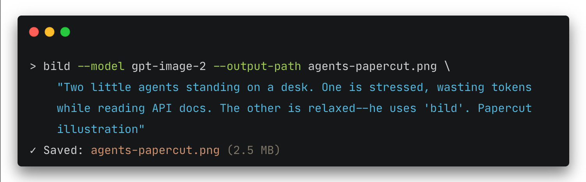
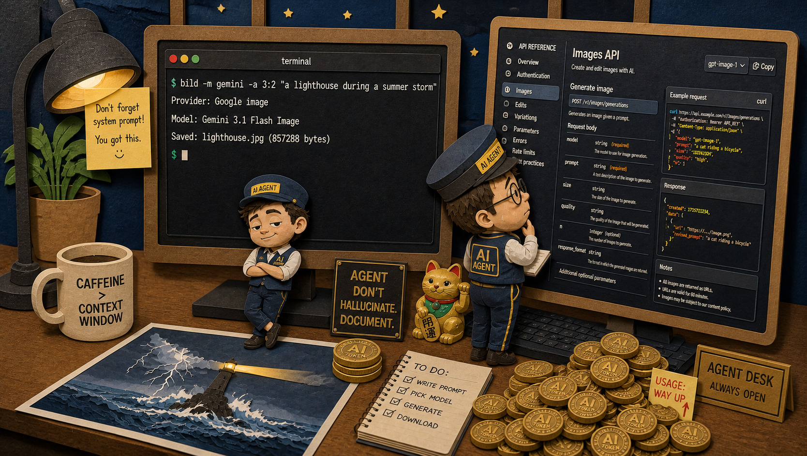
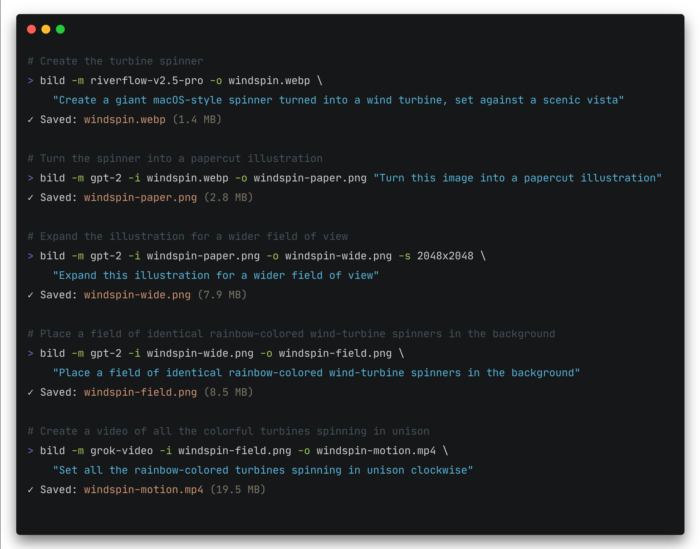
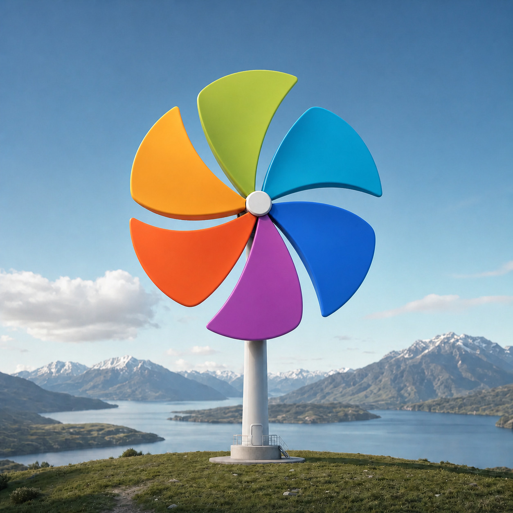
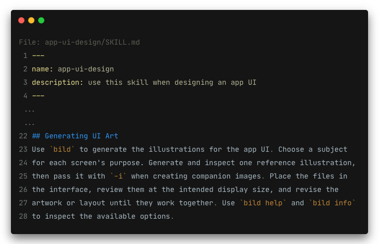
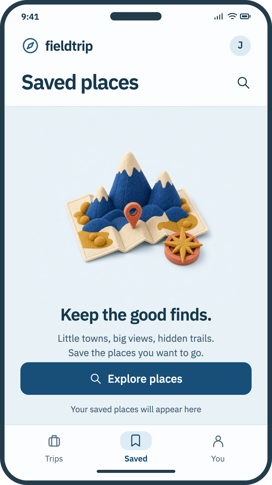
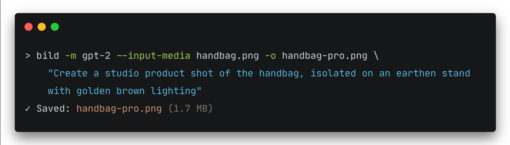
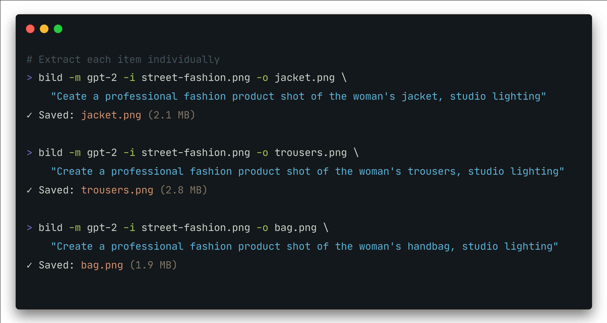
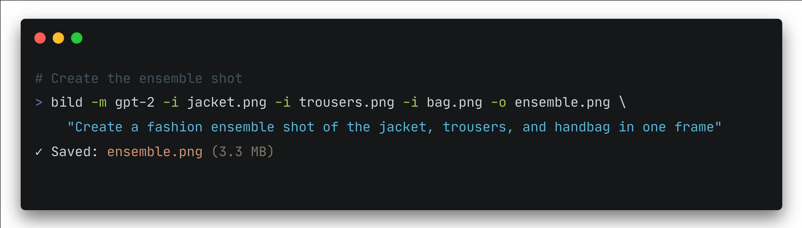

<h1>
  <picture>
    <source media="(prefers-color-scheme: dark)" srcset="assets/logo/bildomat-horizontal-dark-transparent.svg">
    <source media="(prefers-color-scheme: dark)" srcset="assets/logo/bildomat-horizontal-dark-transparent.png">
    <source srcset="assets/logo/bildomat-horizontal-light-transparent.svg">
    
  </picture>
</h1>

# Multiple providers. 150+ models. One `bild` command

[Overview](#overview) | [Quickstart](#quickstart) | [Basic Usage](#basic-usage) | [Agentic Use](#agentic-use) | [Scripting](#scripting) | [Providers and API Keys](#providers-and-api-keys) | [Configuration](#configuration)

## Overview

### Image and video generation for scripts, agents, and your terminal

Bildomat provides a single unified interface to multiple image and video generation providers. The `bild` command handles requests, waits for generations, polls for results, and saves the media to disk.

**Supported Providers**:

- **Google**: 9 models (4 image models · 5 video models)
- **OpenAI**: 9 models (7 image models · 2 video models)
- **Black Forest Labs**: 22 models (21 image models · 1 video model)
- **xAI**: 6 models (4 image models · 2 video models)
- **Sourceful**: 2 models (2 image models)
- **Recraft**: 20 models (16 image models)
- **Kling**: 10 models (4 image models · 6 video models)
- **OpenRouter** (multi-provider aggregator): 80 models (51 image models · 29 video models)

See [Providers and API Keys](#providers-and-api-keys) for setting up API keys and configuring them in your environment.

**Script with `bild` for repeatable jobs.** A shell loop can turn a folder of product photos into studio shots, animate product stills, or generate daily hero images for websites.

**Teach your agent to use `bild` for images and illustrations.** With `bild`, a design agent can generate, inspect, and refine images and videos for any design project. Generate images for web design, create uniform stylized illustrations for an app UI, or enhance a newsletter or report with suitable artwork.

<p align="center">
<picture width="850">
  <source srcset="assets/agents/cmd.svg" type="image/svg+xml" />
  
</picture>
</p>

<p align="center">
  
</p>

---

### Chain `bild` commands by using the output of one as input to another

#### Demo: animate a field of colorful turbine spinners

A rainbow spinner becomes a wind turbine, then a papercut illustration, then a landscape full of companions. Finally, the blades begin to turn. The sequence uses Sourceful, OpenAI, and xAI through the same `bild` interface, with each result available as the next request's input.

<p align="center">
    
</p>

<p align="center">
<picture width="850">
  <source srcset="assets/windspin/cmd.svg" type="image/svg+xml" />
  
</picture>
</p>

<p align="center">
  
  
  
  

<p align="center">
    
</p>

<p align="center">
  <a href="assets/windspin/motion.mp4" download="windspin-motion.mp4">Download the video</a>
</p>


---

### Make your design agents more effective

Put `bild` into your agent skills to dramatically enhance their design capabilities.

For example, an app design skill already guides an agent through screens, copy, navigation, and layout. Give it `bild`, and it can make sets of illustrations in a uniform style. Each screen gets its own subject, with a shared material, palette, and lighting.

Add an instruction like this to your skill:

<p align="center">
<picture width="800">
  <source srcset="assets/agents/app-ui-skill.svg" type="image/svg+xml" />
  
</picture>
</p>

Your agent can then generate sets of illustrations for each screen, maintaining a consistent style across the entire app.

<p align="center">
  
</p>

---

### Turn everyday photos into professional product shots

<p align="center">
<picture width="800">
  <source srcset="assets/product/bag-cmd.svg" type="image/svg+xml" />
  
</picture>
</p>

<p align="center">
  
  
</p>

*The source photo and a generated studio treatment.*

**Do it once, then script it.**

Refine the prompt by iterating as necessary. Then script it to automatically run the same task over full batches of everyday images:

```bash
#!/usr/bin/env bash
set -e

for source_photo in products/*.jpg; do
  photo=${source_photo##*/}
  bild -m openai/gpt-image-2 -i "$source_photo" \
    -o "studio/${photo%.jpg}.png" -p \
    "Create a professional studio-quality product shot of the product,
     seamless white background. Preserve its shape, materials, and details."
done
```

To vary it for different batches, change the prompt to describe a different setup, lighting style, or setting.

---

### Advanced Workflow: Ensemble Product Shot

For a more advanced workflow, such as creating a fashion ensemble product shot, run separate commands to extract each item and then combine them back into a single shot.

**The source photo**: a street shot of a woman in a casual outfit.

<p align="center">
  
</p>

**Extracting the items**: for best resutls, first create a product shot of each item individually.

<p align="center">
<picture width="800">
  <source srcset="assets/ensemble/fashion-cmd.svg" type="image/svg+xml" />
  
</picture>
</p>

<p align="center">
  
  
  
</p>

**Put it together**: combine the individual product shots into a single ensemble image.

<p align="center">
<picture width="800">
  <source srcset="assets/ensemble/ensemble-cmd.svg" type="image/svg+xml" />
  
</picture>
</p>

<p align="center">
  
</p>

## Quickstart

### Install

With [Go 1.26.5 or later](https://go.dev/dl/) on macOS, Linux, or Windows:

```sh
go install github.com/shdeen/bildomat/cmd/bild@latest
```

Go usually installs binaries to `~/go/bin`. Make sure that directory is on your `PATH`.

For a standard Bash or Zsh setup, add this to `~/.bashrc` or `~/.zshrc`:

```sh
export PATH="$HOME/go/bin:$PATH"
```

### Set up a provider API key

API keys may be set in the Bildomat configuration file or in shell environment variables.

[Providers and API Keys](#providers-and-api-keys) | [Configuration](#configuration)

#### The Bildomat configuration file

The Bildomat configuration file is in YAML format within the Bildomat directory under your home directory. To set it up, create a `config.yml` file at the following path: `~/.bildomat/config.yml`. Then add your API key to `config.yml` as follows:

```yaml
api-keys:
  google: your-google-api-key
```

#### A shell environment variable

To set up the API key in your shell environment, use the environment variable listed for your provider in the [Providers and API Keys](#providers-and-api-keys) section below.

Set the environment variable for your chosen provider by exporting it from your shell. For example, for Google, run:

```sh
export GOOGLE_API_KEY="your-google-api-key"
```

To have your shell load with your environment variable at startup, add the above command to your shell configuration file, such as `~/.bashrc` or `~/.zshrc`.

### Generate your first image

Run `bild` with `-m, --model` to use a model from your configured provider.

```sh
bild -m google/gemini-3.1-flash-image \
  "a fox reading a storybook surrounded by forest friends"
```

By default, the file will save to your current directory. To specify a different output location, use the `-o`/`--output-path` option.

```sh
bild -m google/gemini-3.1-flash-image -o ~/your/path/ \
  "a fox reading a storybook surrounded by forest friends"
```

Alternatively, you can set an output directory in the configuration file to have `bild` save generated media there by default. Using the `-o`/`--output-path` flag overrides the both the system default and that of your config setup.

You may also set up a default model by setting it in the configuration file. Specifying the `-m`/`--model` option overrides both the system's default model and any model you set up in config.yml.

To see the default model, run `bild help` and check the `-m`/`--model` option. Note: to use the program's default model, you must have an API key set up for that model provider.

<details>
<summary>Windows PowerShell</summary>

Set the key for the current session:

```powershell
$env:GOOGLE_API_KEY = "your-google-api-key"
```

Add that assignment to your PowerShell profile to keep it across sessions, or use the same configuration file at `$HOME/.bildomat/config.yml`.

</details>

## Basic Usage

Put options before the quoted prompt. Select a model with `-m`, supply an image or video reference with `-i`, and choose an output path with `-o`.

```sh
# Generate an image
bild "logo for a cryo-monitoring company"

# Choose a model and output file
bild -m openai/gpt-image-2 -o logo.png \
  "logo for a cryo-monitoring company"

# Edit a photo or use it as a visual reference
bild -m google/gemini-3.1-flash-image -i product.jpg -o studio.png \
  "Place this product on a white studio background with soft lighting"

# Animate a still image
bild -m xai/grok-imagine-video -i landscape.png -d 6 -o landscape.mp4 \
  "A slow camera push toward the mountains as clouds drift overhead"
```

Model names can be aliases, such as `gemini`, `gpt`, or `grok-video`, or full provider/model names as above. A full name fixes the provider and model used by a script.

### Find models and inspect their options

```sh
bild help                        # General usage
bild list                        # Providers and their models
bild search gpt                  # Search for a provider or model with a partial name
bild help search                 # Help for a command
bild info google                 # All info about a provider, its models, and supported flags
bild info gpt-image-2            # All info about a model and supported flags
```

Use the basic filters with `list` or `search` or provide a search term to search the beginning of any provider or model name. For more advanced pattern searches or to search for any part of a model or provider name, use the `-r`/`--regex` option.

```sh
# Basic filters
bild list -p                     # Show providers list only
bild list -m                     # Show models list only
bild list -i                     # Show image models only
bild list -v                     # Show video models only

# Advanced search, list, and info options
bild search flux                 # Any name beginning with "flux"
bild search -v flux              # Any name beginning with "flux" and is a video model 
bild search -r vector            # Any name with "vector" in it
bild search -r 'pro|max'         # Any name with either "pro" or "max" in it
bild search -r 'gemini.*pro'     # All gemini pro versions
bild list -j                     # Full provider and model list in JSON
bild search -j flux              # All model names beginning with "flux", in JSON
bild info -j google              # All info about google and its models, in JSON
```

`list` and `search` share the `-p`, `-m`, `-i`, and `-v` filters. A normal search matches the beginning of any slash-delimited part of a full model name, or an alias, without regard to case. `-r`/`--regex` searches anywhere and supports more complex patterns.

`list`, `search`, and `info` all accept `-j`/`--json`. Help is text-only. Model capabilities differ; `bild info <model>` shows the supported flags, limits, and allowed values.

### Specify where files are saved

| Output option | Meaning |
| --- | --- |
| `-o images/` | Save to a specific directory; create it and any missing parents. |
| `-o images/fox.png` | Save to a specific directory, with a specific filename and format. Note: specifying a file extension is the same as setting the `-f`/`--output-format` option |
| `-o images/fox` | Use `fox` as the filename stem and the provider's default output format as the extension, unless that path is to an existing directory; if that directory exists, the media is saved to that directory with the default filename and returned format (e.g. bild-image.jpg). |
| No `-o` | Use the default output directory and default filename. The default directory is the current directory or, if set, the output-dir setting in the config file. |

An explicit `-o` replaces the configured output directory. Bare filenames and relative paths resolve from the current directory. Existing media files are preserved under numbered filenames. The saved extension follows the actual media format, so use the returned path when passing a result to another command.

## Agentic Use

Add `bild` to your agent instructions (e.g. AGENTS.md, CLAUDE.md) for all image and video generation tasks. Specify `bild` in agent skills (e.g. a design skill for a web frontend or app UI) to have image and video generation become part of the agent's existing workflow.

Calling provider APIs directly makes an agent spend a large amount of tokens finding and reading API documentation, building requests and payloads, polling jobs, then downloading and decoding the requested media. Bildomat puts that work behind one discoverable CLI.

Your agents deserve better!

## Scripting

**Capture a filename.** `-p`/`--print-filename` makes saved paths the only non-error output, one per line. Use it to connect generation to the next edit:

```bash
#!/usr/bin/env bash
set -e

reference_image=$(bild -m openai/gpt-image-2 -o reference.png -p \
  "A blue felt suitcase and a folded map, pale blue background")

bild -m openai/gpt-image-2 -i "$reference_image" -o companion.png -p \
  "Create a companion illustration of a tent and backpack.
   Match the reference's felt materials, colors, light, and composition."
```

**Capture a report.** `-j`/`--json` returns the generation status, model, submitted flags, saved paths, adjustments, and errors:

```sh
bild -m google/gemini-3.1-flash-image -o fox.png -j \
  "a fox reading a storybook surrounded by forest friends" > generation.json
```

The saved files are in `artifacts[].path`. A completed generation has `status: "completed"`. To save the JSON report and print only filenames to the shell at the same time:

```sh
bild -m google/gemini-3.1-flash-image -o fox.png \
  -j --save-results generation.json -p \
  "a fox reading a storybook surrounded by forest friends"
```

The report file is replaced if it already exists. Use a distinct report name for each run when keeping a history.

| Exit code | Meaning |
| --- | --- |
| `0` | Command succeeded, or an interactive confirmation was declined. |
| `1` | Generation or another operation failed, or generation was canceled. |
| `2` | Command-line usage error. |

Bildomat handles requests, polling, downloads, and file saving. Your script controls the sequence and what happens on failure. For deterministic workflows, select a full model name, specify the output location, and check the exit status and report. Bildomat reports adjustments to unsupported settings; inspect those when exact dimensions or other constraints matter.

## Providers and API Keys

To generate images with Bildomat, you need an API key from a supported provider.

To create an API key, see the list below and the API key URL for each provider. If prompted to, set up an account with the desired provider, and then follow the site's instructions to generate an API key.

An API key is usually associated with a billing account, which may require a payment method and/or the purchase of API usage credits. Image generation costs vary widely, so check the provider's pricing page carefully before using. For a very rough range, image generations may cost anywhere from $0.01–$0.25 per generated image; video generation is typically higher cost. Your exact usage cost will depend on the provider, model, generation type, and other factors. Be sure to monitor your usage and to track costs for your image and video generations.

All configuration keys in this table belong under `api-keys` in config. yml. See below for a config file example.

| Provider | Website & API keys | Config key | Environment variable |
| --- | --- | --- | --- |
| **Google — Gemini & Veo** | [Google AI Studio keys](https://aistudio.google.com/apikey) | `google` | `GOOGLE_API_KEY` |
| **OpenAI** | [API keys](https://platform.openai.com/api-keys) | `openai` | `OPENAI_API_KEY` |
| **xAI** | [API keys](https://console.x.ai/team/default/api-keys) | `xai` | `XAI_API_KEY` |
| **Black Forest Labs** | [Dashboard](https://dashboard.bfl.ai/) (project → **API Keys**) | `bfl` | `BFL_API_KEY` |
| **Sourceful / Riverflow** | [API keys](https://www.riverflow.ai/app/team-settings/api) | `sourceful` | `SOURCEFUL_API_KEY` |
| **Recraft** | [Profile → **API**](https://app.recraft.ai/profile/api) | `recraft` | `RECRAFT_API_KEY`
| **Kling** | [API keys](https://kling.ai/dev/api-key) | `kling` | `KLING_API_KEY` |
| **OpenRouter** | [API keys](https://openrouter.ai/settings/keys) | `openrouter` | `OPENROUTER_API_KEY` |

**Note:** An OpenRouter API key allows access to models from many of the above providers with a single API key. Use `bild list -m` to see which models are available through each provider.

[MIT license](LICENSE).

## Configuration

All settings in `~/.bildomat/config.yml` are optional. `default-model` applies when `-m` is omitted; `output-dir` applies when `-o` is omitted. Without a configured model, Bildomat uses its built-in default, which may change between releases. Keys in this file take precedence over environment variables.

```yaml
default-model: google/gemini-3.1-flash-image
output-dir: ~/Pictures/bildomat

api-keys:
  google: your-google-api-key
  openai: your-openai-api-key
  bfl: your-bfl-api-key
  xai: your-xai-api-key
  sourceful: your-sourceful-api-key
  recraft: your-recraft-api-key
  kling: your-kling-api-key
  openrouter: your-openrouter-api-key
```
